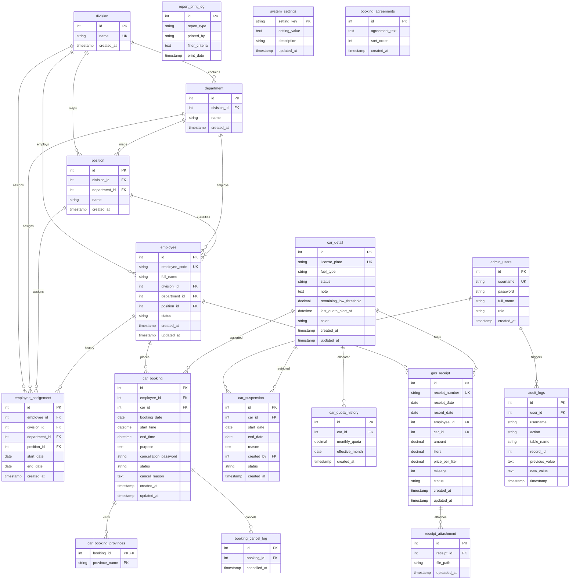

# เอกสารอ้างอิงฐานข้อมูลระบบ FuelFleet™ (ER-Diagram & Data Dictionary)
เอกสารนี้จัดทำขึ้นเพื่อแสดงโครงสร้างความสัมพันธ์และพจนานุกรมข้อมูล (Data Dictionary) ของฐานข้อมูลระบบ **FuelFleet** ทั้งหมด 18 ตาราง

---

## 📊 แผนภาพความสัมพันธ์ของข้อมูล (ER-Diagram)

---

## 📘 พจนานุกรมข้อมูล (Data Dictionary)

### 1. ตาราง `admin_users`
เก็บข้อมูลบัญชีผู้ใช้งานระบบหลังบ้านสำหรับผู้ดูแลระบบ (Admin/Super Admin)

| ชื่อฟิลด์ (Field) | ประเภท (Type) | คีย์ (Key) | ยอมรับค่าว่าง | คำอธิบาย (Description) |
| :--- | :--- | :---: | :---: | :--- |
| `id` | INT | PK | No | รหัสรันอัตโนมัติประจำแถว (Auto Increment) |
| `username` | VARCHAR(100) | UK | No | บัญชีผู้ใช้งานระบบเพื่อล็อกอิน (ห้ามซ้ำ) |
| `password` | VARCHAR(255) | - | No | รหัสผ่านผู้ใช้ที่ผ่านการเข้ารหัส Bcrypt เรียบร้อย |
| `full_name` | VARCHAR(255) | - | No | ชื่อ-นามสกุลจริงของผู้ดูแลระบบ |
| `role` | VARCHAR(50) | - | No | บทบาทสิทธิ์ใช้งานระบบ (Default: `'admin'`) |
| `created_at` | TIMESTAMP | - | No | วันเวลาที่สร้างบัญชีผู้ใช้งานระบบนี้ |

---

### 2. ตาราง `division`
เก็บข้อมูลหน่วยงานหลักระดับสำนัก/กอง ขององค์กร

| ชื่อฟิลด์ (Field) | ประเภท (Type) | คีย์ (Key) | ยอมรับค่าว่าง | คำอธิบาย (Description) |
| :--- | :--- | :---: | :---: | :--- |
| `id` | INT | PK | No | รหัสประจำกอง/สำนัก (Auto Increment) |
| `name` | VARCHAR(255) | UK | No | ชื่อเต็มของกอง/สำนัก (ห้ามซ้ำ เช่น 'สำนักปลัด', 'กองกลาง') |
| `created_at` | TIMESTAMP | - | No | วันเวลาที่สร้างรายการข้อมูล |

---

### 3. ตาราง `department`
เก็บข้อมูลฝ่ายงานย่อยที่สังกัดอยู่ภายใต้กอง/สำนัก (`division`)

| ชื่อฟิลด์ (Field) | ประเภท (Type) | คีย์ (Key) | ยอมรับค่าว่าง | คำอธิบาย (Description) |
| :--- | :--- | :---: | :---: | :--- |
| `id` | INT | PK | No | รหัสประจำฝ่ายงาน (Auto Increment) |
| `division_id` | INT | FK | Yes | เชื่อมไปยังกองหลัก `division.id` (ตั้งค่าเป็น NULL หากลบกองหลัก) |
| `name` | VARCHAR(255) | - | No | ชื่อเต็มของฝ่ายงานย่อย (เช่น 'ฝ่ายโยธา', 'ฝ่ายยานพาหนะ') |
| `created_at` | TIMESTAMP | - | No | วันเวลาที่สร้างรายการข้อมูล |

---

### 4. ตาราง `position`
เก็บข้อมูลชื่อตำแหน่งพนักงาน เชื่อมโยงระดับหน่วยงาน

| ชื่อฟิลด์ (Field) | ประเภท (Type) | คีย์ (Key) | ยอมรับค่าว่าง | คำอธิบาย (Description) |
| :--- | :--- | :---: | :---: | :--- |
| `id` | INT | PK | No | รหัสประจำตำแหน่ง (Auto Increment) |
| `division_id` | INT | FK | Yes | เชื่อมไปหา `division.id` ของตำแหน่งนั้น |
| `department_id` | INT | FK | Yes | เชื่อมไปหา `department.id` ของตำแหน่งนั้น |
| `name` | VARCHAR(255) | - | No | ชื่อตำแหน่งอย่างเป็นทางการ (เช่น 'พนักงานขับรถ', 'ผู้อำนวยการ') |
| `created_at` | TIMESTAMP | - | No | วันเวลาที่สร้างรายการข้อมูล |

---

### 5. ตาราง `employee`
เก็บข้อมูลบัญชีรายชื่อพนักงานทั้งหมดที่มีสิทธิ์เข้าใช้งานระบบหรือเบิกน้ำมัน

| ชื่อฟิลด์ (Field) | ประเภท (Type) | คีย์ (Key) | ยอมรับค่าว่าง | คำอธิบาย (Description) |
| :--- | :--- | :---: | :---: | :--- |
| `id` | INT | PK | No | รหัสภายในพนักงาน (Auto Increment) |
| `employee_code` | VARCHAR(50) | UK | No | รหัสประจำตัวข้าราชการ/พนักงาน (ห้ามซ้ำ) |
| `full_name` | VARCHAR(255) | - | No | ชื่อและนามสกุลจริงของพนักงาน |
| `division_id` | INT | FK | Yes | เชื่อมไปยังกองสังกัดปัจจุบัน `division.id` |
| `department_id` | INT | FK | Yes | เชื่อมไปยังฝ่ายสังกัดปัจจุบัน `department.id` |
| `position_id` | INT | FK | No | เชื่อมไปยังรหัสตำแหน่งปัจจุบัน `position.id` |
| `status` | VARCHAR(50) | - | No | สถานะงาน (เช่น `'Active'`, `'Retired'`, `'Resigned'`) |
| `created_at` | TIMESTAMP | - | No | วันเวลาที่ลงทะเบียนพนักงาน |
| `updated_at` | TIMESTAMP | - | No | วันเวลาที่มีการอัปเดตประวัติล่าสุด |

---

### 6. ตาราง `employee_assignment`
เก็บประวัติความเคลื่อนไหวการดำรงตำแหน่งและการโยกย้ายแผนกของพนักงาน

| ชื่อฟิลด์ (Field) | ประเภท (Type) | คีย์ (Key) | ยอมรับค่าว่าง | คำอธิบาย (Description) |
| :--- | :--- | :---: | :---: | :--- |
| `id` | INT | PK | No | รหัสรันประวัติ (Auto Increment) |
| `employee_id` | INT | FK | No | เชื่อมไปหาพนักงาน `employee.id` (ลบอัตโนมัติหากพนักงานโดนลบ) |
| `division_id` | INT | FK | No | เชื่อมไปหาหน่วยงาน `division.id` ณ ขณะย้าย |
| `department_id` | INT | FK | No | เชื่อมไปหาฝ่ายงาน `department.id` ณ ขณะย้าย |
| `position_id` | INT | FK | No | เชื่อมไปหารหัสตำแหน่ง `position.id` ณ ขณะย้าย |
| `start_date` | DATE | - | No | วันที่คำสั่งแต่งตั้ง/โยกย้ายมีผล |
| `end_date` | DATE | - | Yes | วันสุดท้ายของการดำรงตำแหน่ง (ว่างอยู่หากเป็นงานปัจจุบัน) |
| `created_at` | TIMESTAMP | - | No | วันเวลาที่คำสั่งถูกป้อนเข้าระบบ |

---

### 7. ตาราง `car_detail`
เก็บข้อมูลรายละเอียดของยานพาหนะส่วนกลางขององค์กร

| ชื่อฟิลด์ (Field) | ประเภท (Type) | คีย์ (Key) | ยอมรับค่าว่าง | คำอธิบาย (Description) |
| :--- | :--- | :---: | :---: | :--- |
| `id` | INT | PK | No | รหัสประจำรถภายใน (Auto Increment) |
| `license_plate` | VARCHAR(50) | UK | No | เลขทะเบียนรถยนต์และจังหวัด (ห้ามซ้ำ เช่น 'กข-1234') |
| `fuel_type` | VARCHAR(50) | - | No | สเปกประเภทน้ำมันเชื้อเพลิง (เช่น Diesel, Gasohol 95) |
| `status` | VARCHAR(50) | - | No | สถานะใช้งานรถ (เช่น `'Active'` พร้อมจอง, `'Suspended'` ปิดซ่อม) |
| `note` | TEXT | - | Yes | หมายเหตุหรือคำอธิบายประกอบการใช้งานรถ |
| `remaining_low_threshold` | DECIMAL(10,2) | - | No | เกณฑ์เตือนลิตรน้ำมันคงเหลือต่ำสุดของคันนี้ (Default: `20.00`) |
| `last_quota_alert_at` | DATETIME | - | Yes | วันเวลาที่ระบบยิงแจ้งเตือนต่ำเกณฑ์ไปที่ Discord ล่าสุด |
| `color` | VARCHAR(50) | - | No | รหัสสี Hex ประจำรถยนต์เพื่อแสดงบนปฏิทินจอง (เช่น `#4f46e5`) |
| `created_at` | TIMESTAMP | - | No | วันที่สร้างข้อมูลรถยนต์คันนี้เข้าระบบ |
| `updated_at` | TIMESTAMP | - | No | วันเวลาที่อัปเดตรายละเอียดรถล่าสุด |

---

### 8. ตาราง `car_booking`
เก็บข้อมูลคำขอจองคิวการใช้รถยนต์ส่วนกลางออกราชการ

| ชื่อฟิลด์ (Field) | ประเภท (Type) | คีย์ (Key) | ยอมรับค่าว่าง | คำอธิบาย (Description) |
| :--- | :--- | :---: | :---: | :--- |
| `id` | INT | PK | No | รหัสรันรายการจอง (Auto Increment) |
| `employee_id` | INT | FK | No | รหัสผู้จอง เชื่อมต่อกับ `employee.id` |
| `car_id` | INT | FK | No | รหัสรถยนต์ที่จอง เชื่อมต่อกับ `car_detail.id` |
| `booking_date` | DATE | - | No | วันจองรถ (ใช้คัดกรองสถิติการใช้งาน) |
| `start_time` | DATETIME | - | No | วันเวลาที่เริ่มออกเดินทางจริง |
| `end_time` | DATETIME | - | No | วันเวลาเดินทางกลับถึงที่พัก |
| `purpose` | TEXT | - | No | วัตถุประสงค์และรายละเอียดการเดินทาง |
| `cancellation_password` | VARCHAR(255) | - | No | รหัสผ่านสำหรับการกดยกเลิกการจองผ่านปฏิทินด้วยตนเอง |
| `status` | VARCHAR(50) | - | No | สถานะการจอง (เช่น `'Pending'` รออนุมัติ, `'Confirmed'` อนุมัติ, `'Cancelled'` ยกเลิก) |
| `cancel_reason` | TEXT | - | Yes | ระบุสาเหตุที่ยกเลิกการจอง (กรณีแอดมินหรือผู้ใช้กดยกเลิก) |
| `created_at` | TIMESTAMP | - | No | วันเวลาที่ยื่นคำขอจอง |
| `updated_at` | TIMESTAMP | - | No | วันเวลาอัปเดตสถานะล่าสุด |

---

### 9. ตาราง `car_booking_provinces`
เก็บข้อมูลจังหวัดปลายทางของการเดินทางจองใช้งาน (รองรับการเดินทางไปมากกว่าหนึ่งจังหวัดในรอบเดียว)

| ชื่อฟิลด์ (Field) | ประเภท (Type) | คีย์ (Key) | ยอมรับค่าว่าง | คำอธิบาย (Description) |
| :--- | :--- | :---: | :---: | :--- |
| `booking_id` | INT | PK, FK | No | รหัสรายการจองที่เกี่ยวข้อง เชื่อมไปยัง `car_booking.id` (ลบออกอัตโนมัติเมื่อรายการจองถูกลบ) |
| `province_name` | VARCHAR(100) | PK | No | ชื่อจังหวัดปลายทาง (เช่น 'กรุงเทพมหานคร', 'นครปฐม') |

---

### 10. ตาราง `car_suspension`
เก็บประวัติข้อมูลการออกคำสั่งระงับการจองใช้งานรถยนต์ชั่วคราวเพื่อนำรถไปซ่อมบำรุง

| ชื่อฟิลด์ (Field) | ประเภท (Type) | คีย์ (Key) | ยอมรับค่าว่าง | คำอธิบาย (Description) |
| :--- | :--- | :---: | :---: | :--- |
| `id` | INT | PK | No | รหัสคำสั่งระงับ (Auto Increment) |
| `car_id` | INT | FK | No | รหัสรถที่ปิดซ่อม เชื่อมโยงกับ `car_detail.id` (ลบข้อมูลออกหากรถถูกลบจากคลัง) |
| `start_date` | DATE | - | No | วันแรกที่เริ่มต้นระงับการใช้งาน |
| `end_date` | DATE | - | No | วันสุดท้ายของการระงับการใช้งาน |
| `reason` | TEXT | - | No | สาเหตุการปิดซ่อมบำรุงหรือสาเหตุที่ยกเว้นการใช้งาน |
| `created_by` | INT | FK | No | รหัสแอดมินผู้ออกคำสั่ง เชื่อมโยงกับ `admin_users.id` |
| `status` | VARCHAR(50) | - | No | สถานะคำสั่ง (เช่น `'Active'` บังคับใช้, `'Cancelled'` ปลดล็อกแล้ว) |
| `created_at` | TIMESTAMP | - | No | วันเวลาที่บันทึกข้อมูลคำสั่ง |

---

### 11. ตาราง `car_quota_history`
เก็บข้อมูลประวัติวงเงินกำหนดโควต้าปริมาณน้ำมันเชื้อเพลิงรายเดือนของรถยนต์หลวงแต่ละคัน

| ชื่อฟิลด์ (Field) | ประเภท (Type) | คีย์ (Key) | ยอมรับค่าว่าง | คำอธิบาย (Description) |
| :--- | :--- | :---: | :---: | :--- |
| `id` | INT | PK | No | รหัสวงเงินโควต้า (Auto Increment) |
| `car_id` | INT | FK | No | รหัสรถยนต์ที่ได้รับกำหนด เชื่อมโยงกับ `car_detail.id` (ลบโควต้าหากลบข้อมูลรถยนต์) |
| `monthly_quota` | DECIMAL(10,2) | - | No | วงเงินโควต้าน้ำมันสูงสุดต่อเดือน (หน่วยเป็นลิตร L เช่น `300.00`) |
| `effective_month` | DATE | - | No | วันที่มีผลบังคับใช้ (เก็บข้อมูลในรูปแบบวันแรกของเดือน เช่น `2026-05-01`) |
| `created_at` | TIMESTAMP | - | No | วันเวลาที่ลงทะเบียนโควต้า |

---

### 12. ตาราง `gas_receipt`
เก็บข้อมูลใบเสร็จรับเงินค่าน้ำมันสำหรับการตรวจสอบเบิกจ่ายและการคำนวณสะสมวงเงิน

| ชื่อฟิลด์ (Field) | ประเภท (Type) | คีย์ (Key) | ยอมรับค่าว่าง | คำอธิบาย (Description) |
| :--- | :--- | :---: | :---: | :--- |
| `id` | INT | PK | No | รหัสระบบใบเสร็จ (Auto Increment) |
| `receipt_number` | VARCHAR(100) | UK | No | เลขที่ใบเสร็จรับเงินจริง (ห้ามซ้ำ เฉพาะที่สถานะไม่ถูกยกเลิก) |
| `receipt_date` | DATE | - | No | วันที่เติมน้ำมันระบุในใบเสร็จ |
| `record_date` | DATE | - | No | วันที่คีย์เอกสารบันทึกเข้าระบบ |
| `employee_id` | INT | FK | No | รหัสพนักงานผู้ขอเบิก เชื่อมโยงกับ `employee.id` |
| `car_id` | INT | FK | No | รหัสรถยนต์หลวงคันที่เติม เชื่อมโยงกับ `car_detail.id` |
| `amount` | DECIMAL(10,2) | - | No | จำนวนเงินจ่ายจริง (บาท ฿ เช่น `1500.00`) |
| `liters` | DECIMAL(10,2) | - | No | ปริมาณน้ำมันที่เติมจริง (ลิตร L เช่น `42.50`) |
| `price_per_liter` | DECIMAL(10,2) | - | No | ราคาน้ำมันเฉลี่ยต่อลิตร (คำนวณอัตโนมัติจาก `amount / liters`) |
| `mileage` | INT | - | Yes | เลขระยะไมล์ปัจจุบันของรถเมื่อทำการเติมน้ำมัน |
| `status` | VARCHAR(50) | - | No | สถานะบิล (เช่น `'Pending verification'` รอตรวจ, `'Verified'` อนุมัติ, `'Cancelled'` ยกเลิก) |
| `created_at` | TIMESTAMP | - | No | วันเวลาที่สร้างประวัติข้อมูล |
| `updated_at` | TIMESTAMP | - | No | วันเวลาอัปเดตล่าสุด |

---

### 13. ตาราง `receipt_attachment`
เก็บเส้นทางไฟล์เอกสารแนบหลักฐาน (เช่น ภาพสแกน JPG หรือเอกสาร PDF) ประกอบการเบิกจ่ายใบเสร็จน้ำมัน

| ชื่อฟิลด์ (Field) | ประเภท (Type) | คีย์ (Key) | ยอมรับค่าว่าง | คำอธิบาย (Description) |
| :--- | :--- | :---: | :---: | :--- |
| `id` | INT | PK | No | รหัสไฟล์แนบ (Auto Increment) |
| `receipt_id` | INT | FK | No | รหัสอ้างอิงใบเสร็จ เชื่อมโยงกับ `gas_receipt.id` (ลบออกทันทีหากใบเสร็จถูกลบ) |
| `file_path` | VARCHAR(255) | - | No | พิกัดหรือที่อยู่ไฟล์เก็บในดิสก์ระบบ (เช่น `/uploads/file_name.pdf`) |
| `uploaded_at` | TIMESTAMP | - | No | วันเวลาที่ทำการอัปโหลดไฟล์หลักฐาน |

---

### 14. ตาราง `booking_cancel_log`
เก็บข้อมูลประวัติล็อกวันเวลาการยกเลิกคำขอจองคิวรถยนต์ส่วนกลาง

| ชื่อฟิลด์ (Field) | ประเภท (Type) | คีย์ (Key) | ยอมรับค่าว่าง | คำอธิบาย (Description) |
| :--- | :--- | :---: | :---: | :--- |
| `id` | INT | PK | No | รหัสประวัติล็อก (Auto Increment) |
| `booking_id` | INT | FK | No | รหัสประวัติการจองที่ยกเลิก เชื่อมโยงกับ `car_booking.id` |
| `cancelled_at` | TIMESTAMP | - | No | วันและเวลาที่การยกเลิกได้รับการดำเนินการจริง |

---

### 15. ตาราง `audit_logs`
เก็บข้อมูลประวัติกิจกรรมสำคัญที่ทำโดยแอดมิน เพื่อความโปร่งใสและตรวจสอบความปลอดภัยย้อนหลัง

| ชื่อฟิลด์ (Field) | ประเภท (Type) | คีย์ (Key) | ยอมรับค่าว่าง | คำอธิบาย (Description) |
| :--- | :--- | :---: | :---: | :--- |
| `id` | INT | PK | No | รหัสลำดับประวัติ (Auto Increment) |
| `user_id` | INT | FK | Yes | รหัสผู้กระทำ เชื่อมโยงกับ `admin_users.id` (เปลี่ยนเป็น NULL ได้หากผู้ใช้ถูกลบ) |
| `username` | VARCHAR(100) | - | Yes | จดบันทึกชื่อผู้ใช้ระบบ ณ จังหวะปฏิบัติงานเพื่อความสะดวกรวดเร็วในการอ่าน |
| `action` | VARCHAR(100) | - | No | ประเภทกิจกรรม (เช่น 'Create', 'Verify receipt', 'Change Password') |
| `table_name` | VARCHAR(100) | - | Yes | ตารางเป้าหมายที่มีการแก้ไขโครงสร้างข้อมูล |
| `record_id` | INT | - | Yes | รหัสของแถวข้อมูลในตารางเป้าหมายที่ถูกจัดการ |
| `previous_value` | LONGTEXT | - | Yes | ข้อความรูปแบบ JSON บันทึกสถานะข้อมูลเดิมก่อนการแก้ไข |
| `new_value` | LONGTEXT | - | Yes | ข้อความรูปแบบ JSON บันทึกสถานะข้อมูลใหม่หลังการแก้ไข |
| `timestamp` | TIMESTAMP | - | No | วันเวลาในการบันทึกประวัติการกระทำ |

---

### 16. ตาราง `report_print_log`
เก็บประวัติการสั่งเรียกสรุปรายงาน หรือการพิมพ์เอกสารราชการออกจากตัวระบบ

| ชื่อฟิลด์ (Field) | ประเภท (Type) | คีย์ (Key) | ยอมรับค่าว่าง | คำอธิบาย (Description) |
| :--- | :--- | :---: | :---: | :--- |
| `id` | INT | PK | No | รหัสรายการล็อกพิมพ์ (Auto Increment) |
| `report_type` | VARCHAR(100) | - | No | ชื่อหรือรูปแบบรายงานที่ถูกปริ้น (เช่น 'Monthly Usage', 'Voucher PDF') |
| `printed_by` | VARCHAR(255) | - | No | ชื่อหรือชื่อผู้ใช้ระบบที่ทำการกดพิมพ์รายงาน |
| `filter_criteria` | TEXT | - | Yes | รายละเอียดการคัดเลือกข้อมูลที่ใช้ส่งค่าพิมพ์ (เช่น ปีงบประมาณ หรือช่วงวันที่กรอง) |
| `print_date` | TIMESTAMP | - | No | วันเวลาที่มีการส่งออกรายงาน |

---

### 17. ตาราง `system_settings`
เก็บการตั้งค่าการปรับแต่งระบบและโครงสร้างแอปพลิเคชันส่วนกลางในรูปแบบ Key-Value pair

| ชื่อฟิลด์ (Field) | ประเภท (Type) | คีย์ (Key) | ยอมรับค่าว่าง | คำอธิบาย (Description) |
| :--- | :--- | :---: | :---: | :--- |
| `setting_key` | VARCHAR(100) | PK | No | ชื่อตัวแปรอ้างอิงหลักระบบ (เช่น `'pdf_report_footer'`, `'discord_notification_settings'`) |
| `setting_value` | TEXT | - | No | ค่าของตัวแปรระบบ (สามารถจัดเก็บเป็นข้อความดิบ หรือ JSON โครงสร้าง) |
| `description` | VARCHAR(255) | - | Yes | คำอธิบายเพิ่มเติมว่าตัวแปรนี้ใช้งานอย่างไร |
| `updated_at` | TIMESTAMP | - | No | วันเวลาที่มีการแก้ไขตั้งค่าล่าสุด |

---

### 18. ตาราง `booking_agreements`
เก็บข้อมูลประวัติข้อตกลงและเงื่อนไขการใช้รถยนต์ราชการส่วนกลางที่จะแสดงในแบบฟอร์มการจอง

| ชื่อฟิลด์ (Field) | ประเภท (Type) | คีย์ (Key) | ยอมรับค่าว่าง | คำอธิบาย (Description) |
| :--- | :--- | :---: | :---: | :--- |
| `id` | INT | PK | No | รหัสประจำข้อตกลง (Auto Increment) |
| `agreement_text` | TEXT | - | No | เนื้อความของข้อตกลงหรือเงื่อนไขที่จะแสดงให้พนักงานกดยอมรับ |
| `sort_order` | INT | - | No | ลำดับการแสดงผลข้อความบนหน้าจอปฏิทินจอง (เรียงจากน้อยไปมาก) |
| `created_at` | TIMESTAMP | - | No | วันเวลาที่มีการเขียนและลงทะเบียนเงื่อนไขนี้ |
